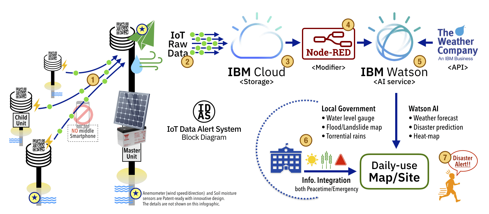

# IDAS - IoT Data Alert System (Call for Code)
- **[Call for Code ORG by David Clark Cause](https://callforcode.org/)**
- **[IBM developer - Call for Code program](https://developer.ibm.com/callforcode/)**

### Our team and basic stance, before Code

Currently, our team members are 2 persons. We just met at "IBM Call for Code hackathon" in Tokyo on 15-Sep-2018. 
Our team is made up of a designer/engineer of IBM champion 2018, and a disaster researcher/official in disaster prevention department of the local government. 
Call for Code is the serious life-saving project. Our team is trying to find the total solution and concrete ideas. That is our basic stance. We would like to show our solution model, before code.

## Save Your Life: IDAS background - Important lessons from the past experiences

- For evacuation, you won’t try to find other new apps under the emergency alerts. No special apps, you might use daily-use one.

- Since the alerts can’t reach to your local people sometimes, the local government needs to devise the other creative solutions to communicate well with them.

- The “AI” is the great helper for us to make the right decision. But you and your family should be saved by you! Your action helps yourself, machines do not.

- The local investigation and raw data are very important. Global forecast analytics doesn’t tell actual ground conditions or danger. That is the important task for the local government.

- It is harder to get the big budget for disasters preparedness than the present problems (such as refugees shelter/food). Integration with the current happenings or daily life/production is one of our total solution ideas.

- Remember the monuments by our ancestors. Find out the historical records of natural disasters. The past records may be 100+ year-old and people forget them. Do not repeat tragedy. [Ref-NYT/Asia](https://www.nytimes.com/2011/04/21/world/asia/21stones.html), [Ref-JpGov/300 Stones](http://www.thr.mlit.go.jp/road/sekihijouhou/gaiyou.pdf)

## Numbers on the Block Diagram (not detailed)

1. Child Units -> Master Unit (LoRa/LoRaWAN Gateway)
    - Data Connection: Gateway collects 2 - 100+ child units data
    - Key Technology: Arm Cortex-M, LoRa/LoRaWAN, MQTT

2. Master Unit -> Cloud Computing
    - Data Connection: Ethernet, Wifi, Telecom …etc.
    - Key Technology: Arm Mbed/Pelion, The Things Network (TTN)
    
3. Data storage
    - Database, Cloud container (K8s)

4. IoT raw data modifier
    - Node-RED, Watson IoT Platform

5. IoT ground data + TWC weather API
    - Providing daily weather forecast with local IoT data together
    - Production planning for local people (Agriculture, Gardening, …etc.)

6. Info. **Integration** by local government
    - **Peacetime**: Weather, Agricultural/Farming info., Local news, Promote evacuation
    - **Emergency**: Push Alerts!, Shelters, Evacuation route, Water/Foods

7. **Preparedness** is the key to save your life from the natural disaster!
    - Let people act, over “**Normarcy bias**” and “**Behavioural sciences**”
    - Good communication with local people in peacetime is important.
    - Education about local disaster risks and Training for disaster risk reduction
    
## IoT Hardware (No.1, 2 on Picture)
### Child Units
- Soil moisture (agriculture / gardening) \*1
- Temperature, Humidity, Air pressure and Sun light.
- Has unique ID (← using NFC hardware key code)
- 3 AA-battery for 2 years with low-powered
- No middle Smartphone

### Master Unit
- All of Child Units functions
- Anemometer (wind speed / direction) \*2
- Water level gauge
- AC or Solar power operations

**Note:** (*1,*2 some are Patent-ready)  
*Soil moisture sensors and Anemometer are key devices for this IoT system. The prototypes with innovative design have been tested, for Durability, Cost, Low-power and Ecology. The details are not shown on this infographic.*

## Local government Operations and Actions (No.6, 7 on Picture) 
### Local information <*Peacetime*>
- Hazard spots/area by local investigation
- Ground surface data, such as Water level, Road construction, …etc.
- Info. for Agricultre, Gardening and other activities/productions
- Local daily information, to be familiarized with
- Colorized layer on local map with simple user interface
### Preparedness, Alert and Evacuation <*Emergency*>
- Flood/Landslide local data
- Evacuation Center/Shelter route map
- Torrential rains, River streamflow info. 
- Water/Food rescue info.

---

## Code for the solutions

Code will be added more..  
Our total solution cares from the physical silicon devices to Web UI. Such a big project and long way...
- IoT, Hardware embedded program (Arm Mbed/Pelion), MQTT
- Cloud Container Kubernetes(K8s) storage and Database
- Node-RED and Watson AI connection/customization
- The Weather Company API and Mapbox mapping
- Customizable Web UI and Layered add-on Info. for local governments

### Code references
- [**IBM Developer - IoT**](https://developer.ibm.com/technologies/iot/)
- [**The long-range IoT systems with LoRaWAN (IBM Code Pattern)**](https://developer.ibm.com/patterns/set-up-lorawan-iot-gateway-hardware/)
- [**Use MQTT to stream real-time data (IBM Code Pattern)**](https://developer.ibm.com/patterns/use-mqtt-stream-real-time-data/)
- [**The Weather Company API Platform (Call for Code)**](https://callforcode.weather.com/)
- [**IBM Cloud Kubernetes Service (K8s)**](https://www.ibm.com/cloud/container-service)
- [**Node-RED nodes for IBM Watson**](https://flows.nodered.org/node/node-red-node-watson)
- [**Arm Mbed/Pelion bridge MQTT to Watson IoT (GitHub)**](https://github.com/ARMmbed/pelion-bridge-container-mqtt)

---
#### References
- [Ref.1 Sendai Framework for Disaster Risk Reduction (EN), Preamble 14](https://www.unisdr.org/we/inform/publications/43291)

---

## License
[Apache 2.0](LICENSE)
