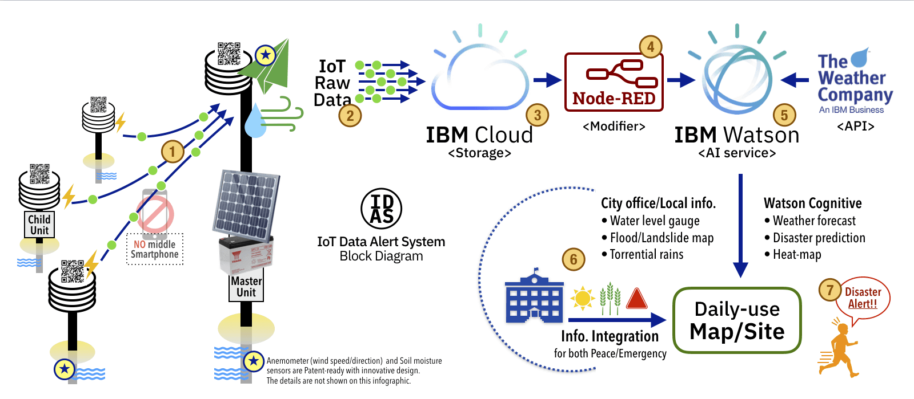

# IDAS - IoT Data Alert System (Call for Code)
- **[Call for Code ORG by David Clark Cause](https://callforcode.org/)**
- **[IBM developer - Call for Code program](https://developer.ibm.com/callforcode/)**

### Our team and basic stance

Currently, our team members are 2 persons. We just met at "IBM Call for Code hackathon" in Tokyo on 15-Sep-2018. 
Our team is made up of a designer/engineer of IBM champion 2018, and a disaster researcher/official in disaster prevention department of the local government. 
  Call for Code is the serious life-saving project. Our team is trying to find the total solution and concrete ideas. That is our basic stance. We would like to show our solution model, before code.

## Save Your Life: IDAS background - Important lessons from the past experiences

- For evacuation, you won’t try to find another new apps under the emergency alerts.
No special apps, you might use daily-use one.

- Since the alerts can’t reach to your local people sometimes, the city office needs to devise the other creative solutions to communicate them.

- The “AI” is the great helper for us to make right decision. But you and your family should be saved by you! Your action helps yourself, machines does not.

- The local investigation and raw data are very important. Global forecast analytics doesn’t tell actual ground conditions or danger. That is the important task for the local city office.

- It is harder to get budget for disasters preparedness than the actual problems (such as refugees shelter/food). Integration with the things currently happening or daily life/production is one of our presentation ideas.

- Remember the stone monuments by our ancestors. Find out the historic records of the natural disaster damages in your town. It may be 100+ year-old and people forgotten them. Do not repeat tragic accidents.

## Notes with numbers on the block diagram

1. Child Units -> Master Unit (Data collection/ 2-100 child units)
    - Carrier: LoraWAN
    - Format: MQTT

2. Master Unit -> Cloud (Internet connection)
    - Carrier: Ethernet, Wifi, Telecom …etc.
    - Format: Secured IoT-Cloud transmission

3. Data storage
    - Cloud container technology (K8s)

4. IoT “raw” data will be modifier
    - Node-RED for Cognitive computing

5. IoT ground data + TWC weather API
    - Providing daily weather forecast with the actual local data
    - Production planning for local people (agriculture, gardening, …etc.)

6. Info. Integration by Local Office;
    - **Peacetime**: Weather, Agricultural/Farming info., Local news, Promotion for evacuation
    - **Emergency**: Push Alerts!, Shelters, Evacuation route, Water/Foods

7. Preparedness is the key to save your life from the natural disaster!
    - Let people act, over “**Normarcy bias**” and “**Behavioural sciences**”
    - Good communication with local people in peacetime is important.

## IoT Hardware (No.1, 2 on Picture)
### Child Units
- Soil moisture (agriculture / gardening) \*1
- Temperature, Humidity, Air pressure and Sun light.
- Has unique ID (←NFC hardware key code)
- 3 AA-battery for 2 years with low-powered
- No middle Smartphone

### Master Unit
- All of Child Units functions
- Anemometer (wind speed / direction) \*2
- Water level gauge
- AC or Solar power operations

**Note:** (*1,*2 some are Patent-ready) Soil moisture sensors and Anemometer are key devices for this IoT system.
The prototypes with innovative design have been tested, for Durability, Cost, Low-power and Ecology.
The details are not shown on this infographic.

## City Office Operations and Actions (No.6, 7 on Picture) 
- Local information (**Peacetime**)
    - Hazard spots/area by local investigation
    - Ground surface data, such as Water level, Road construction, …etc.
    - Info. for Agricultre, Gardening and other activities/productions
    - Local daily information, to be familiarized with
    - Colorized layer on local map with simple user interface
- Prediction, Alert and Evacuation (**Emergency**)
    - Flood/Landslide local data
    - Evacuation Center/Shelter map
    - Torrential rains, River streamflow control info. 
    - Water/Food rescue information

---

## Code for the solusions

Code will be added more..

### IBM Code references
- [**IBM Developer - IoT**](https://developer.ibm.com/technologies/iot/)
- [**The Weather Company API Platform (Call for Code)**](https://callforcode.weather.com/)
- [**Node-RED nodes for IBM Watson**](https://flows.nodered.org/node/node-red-node-watson)

---

## License
[Apache 2.0](LICENSE)
